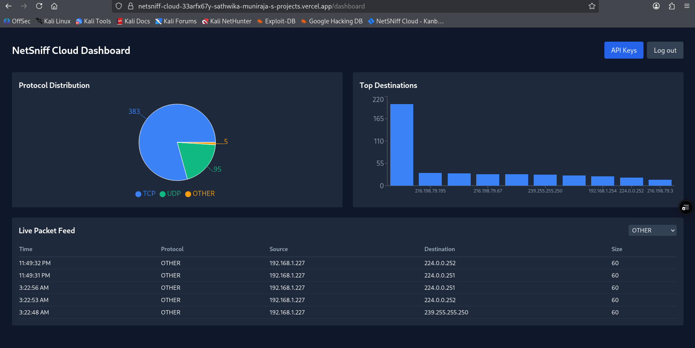
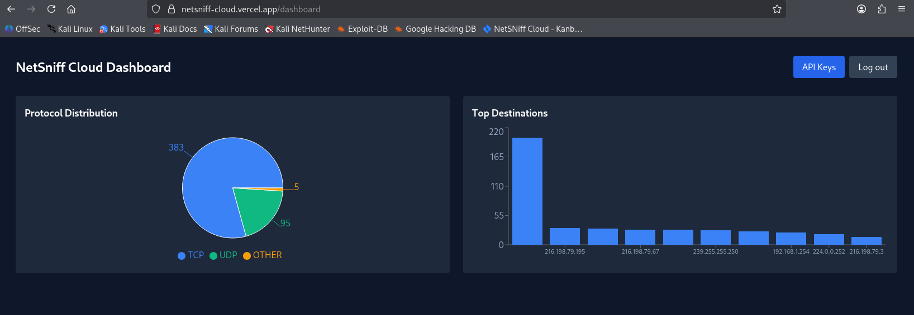

# NetSniff Cloud

**A multi-tenant SaaS for live network traffic monitoring.** A lightweight agent runs on your own machine, captures network packet metadata, and streams it to a cloud dashboard you can watch from any browser — with every user's data fully isolated from every other user's.

🔗 **Live demo:** [netsniff-cloud.vercel.app](https://netsniff-cloud.vercel.app)

> Built as a portfolio project for a Master's in Internetworking. It demonstrates network packet analysis (Scapy, L3/L4), REST API design, multi-tenant data isolation, and cloud-native deployment — the same agent-to-cloud architecture used by real security tools like CrowdStrike, Wazuh, and Datadog.

---

## What it does

1. Sign up with an email and password.
2. Generate an API key from the dashboard (shown once, stored hashed).
3. Download the agent, drop your key into its config, and run it on your machine.
4. Watch your live network traffic appear in the browser — protocol breakdown, top destinations, and a live packet feed you can filter.

Each user only ever sees their own traffic.

---

## Screenshots

**Live dashboard — protocol distribution, top destinations, and the live packet feed:**



**Filtering the live feed by protocol:**


---

## Architecture

Two separate networks — your local machine and the cloud — talking over HTTPS:

```
┌─────────────────────────────┐
│  YOUR MACHINE (Kali Linux)  │
│  ┌───────────────────────┐  │
│  │  sniffer_agent.py     │  │   Scapy captures packets,
│  │  Scapy → metadata     │  │   extracts L3/L4 metadata only,
│  │  → batch → POST       │  │   batches them, and POSTs.
│  └──────────┬────────────┘  │
└─────────────┼───────────────┘
              │ HTTPS + API key
              ▼
┌─────────────────────────────────┐
│            VERCEL               │
│  React dashboard (Vite)         │
│  Python FastAPI (serverless)    │
│   /api/ingest   /api/packets    │
│   /api/stats    /api/health     │
└─────────────┬───────────────────┘
              ▼
┌─────────────────────────────────┐
│           SUPABASE              │
│  Postgres + Row Level Security  │
│  Supabase Auth (email/password) │
└─────────────────────────────────┘
```

**Why capture happens locally:** packet capture needs raw access to a network card, which a stateless serverless function on Vercel doesn't have. So the agent does the capturing on the user's machine; the cloud only receives, stores, and displays.

---

## Tech stack

| Layer | Technology |
|---|---|
| **Agent** | Python + Scapy (runs locally, not deployed) |
| **Frontend** | React (Vite) + Tailwind CSS + Recharts |
| **Backend** | Python FastAPI as Vercel serverless functions |
| **Database & Auth** | Supabase — Postgres with Row Level Security + Supabase Auth |
| **Hosting** | Vercel |

Everything runs on free tiers.

---

## Features

- **Email/password authentication** via Supabase Auth
- **API key management** — generated in-dashboard, shown once, only a SHA-256 hash stored
- **Packet-capture agent** — captures live traffic, extracts L3/L4 metadata only (no payloads), batches and sends with automatic retry on network drops
- **Live packet feed** — auto-refreshes every 2 seconds, newest first
- **Protocol filter** — view all traffic or filter to TCP / UDP / ICMP / OTHER
- **Charts** — protocol distribution (pie) and top destinations (bar)
- **Multi-tenant isolation** — every user's data is walled off at the database layer

---

## Security highlights

- **API keys hashed at rest.** The raw key is shown exactly once at creation; only a SHA-256 hash is stored. A database leak wouldn't expose usable keys.
- **No payload capture.** Only routing-level metadata (protocol, source/destination IP, ports, size, timestamp) is collected — never the contents of traffic. This is privacy and legal safety by design.
- **Row Level Security (RLS) at the database layer.** Defense in depth — even a misconfigured query can't return another user's rows.
- **Per-user isolation, verified.** Tested with two separate accounts: each saw only its own packets, with zero cross-contamination.
- **HTTPS enforced** on all agent-to-cloud traffic (Vercel default).

---

## Running the agent

The dashboard is hosted and ready to use — you only need to run the agent locally to feed it your traffic.

```bash
# 1. Clone the repo and enter the agent folder
git clone https://github.com/sathwika-net/netsniff-cloud.git
cd netsniff-cloud/agent

# 2. Set up an isolated Python environment
python3 -m venv venv
source venv/bin/activate
pip install -r requirements.txt

# 3. Configure it
cp config.example.json config.json
#    Then edit config.json and paste the API key you generated in the dashboard.

# 4. Run it (sudo is required for raw packet capture)
sudo python3 sniffer_agent.py
```

`config.json` is gitignored and should never be committed — it holds your secret API key.

Open the dashboard in your browser, and your traffic will appear live.

---

## Project structure

```
netsniff-cloud/
├── agent/        # Python/Scapy capture agent (runs locally)
├── api/          # FastAPI serverless backend (ingest, packets, stats)
├── frontend/     # React dashboard (auth, charts, live feed)
└── docs/         # Architecture diagram, screenshots
```

---

## Status

V1 complete: authentication, API keys, the capture agent, live feed with filtering, charts, and multi-tenant isolation are all live in production.

_Planned next: anomaly detection (port-scan / unusual-destination), GeoIP enrichment, and session history._